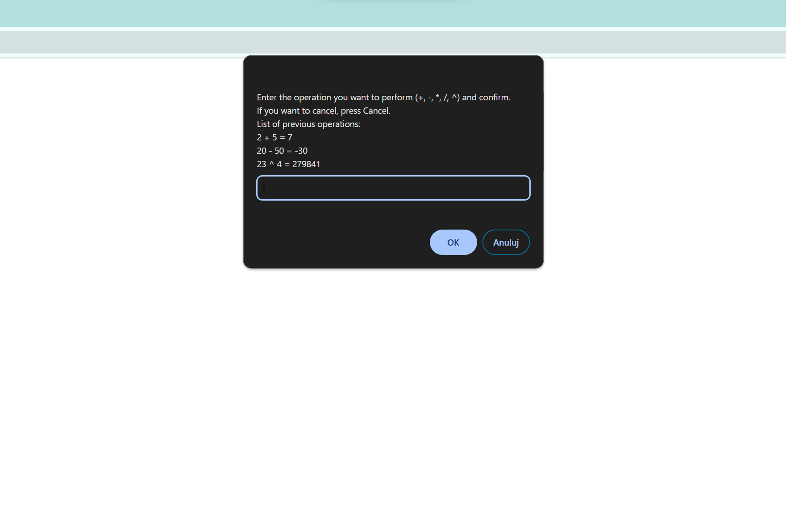

[](https://typee8.github.io/Browser-calculator-in-Javascript/)
# [Browser calculator in Javascript.](https://typee8.github.io/Browser-calculator-in-Javascript/) Don't skip it, please!

I know what you're thinking. What's interesting about a calculator when writing it makes no sense today?! You're absolutely right! Nevertheless, this exercise helps a lot, especially at the beginning of the journey with JS, to memorize the basics of the language and use it properly.

---
## Content:
##### [1) Challenges](#####Challenges)
[1. Test small chunks of code.](#test-small-chunks-of-code)<br>
[2. Obviously NaN !== NaN.](#obviously-nan--nan)<br>
[3. Make code concise.](#make-code-concise)<br>
[4. Regex usage to check for decimal places.](#regex-usage-to-check-for-decimal-places)

##### [2) Gained knowledge](#gained-knowledge)

---
### Test small chunks of code
I wanted to check if `this.history.push(${num1} + ${num2} = ${result});` pushes values correctly to `Calculator.history` array.
It was uncomfortable to test it inside the core code because of other operations that occure when running it. I put the code into another file and tested it separately. It's always beneficial to examine complex code in small chunks, as it makes it much easier to handle:

[You can check whole code here!](https://github.com/devmentor-pl/task-js-basics/blob/8e6069fe5f05b9c693ce10acb09b491add600976/js/app.js)

I've extracted this:
```
function Calculator() {
  this.actions = ["+", "-", "*", "/", "^"];
  this.history = [];
}

Calculator.prototype.add = function (num1, num2) {
  num1 = Number(num1);
  num2 = Number(num2);

  if (num1 !== NaN && num2 !== NaN) {
    const result = num1 + num2;
```
#### ```this.history.push(`${num1} + ${num2} = ${result}`);```
```
    return result;
  }
};
```
Into another file:
```
const history = [];
const num1 = "5";
const num2 = "6";

function add(num1, num2) {
  num1 = Number(num1);
  num2 = Number(num2);

  if (num1 !== NaN && num2 !== NaN) {
    const result = num1 + num2;
    history.push(`${num1} + ${num2} = ${result}`);
    return result;
  }
}

add(num1, num2);
console.log(history);
```

Otherwise, to test `this.history.push`, I would need to go through these operations:
- prompts:
action = prompt(promptContent);
number1 = prompt("Podaj liczbę nr 1");
number2 = prompt("Podaj liczbę nr 2");
- conditionals:
isCorrectAction = calc.isCorrectAction(action);
action === "+";

---
### Obviously NaN !== NaN
You can see in the example above the constantly use of `if (num1 !== NaN && num2 !== NaN)`. I wanted to ensure that the client won't input strings. If `num1` is not a number `num1 = Number(num1);` returns `NaN`, so it was logical thing to write a conditional like aboves. I was certain that it would work until I tested it and saw a surprising result:


It was the time I've learned that **NaN isn't equal to itself**. :confetti_ball: Kudos to me! :tada:

I was looking for a way to check if `num1` and `num2` are `NaN`, and I came across `isNaN()`, which solves the problem in the blink of an eye.

---
### Make code concise

I've created separate prototype's method for every arithmetical operation. A lot of the code has been repeating, so I've decided to make it more concise. I started with:
```
Calculator.prototype.add = function (num1, num2) {
  num1 = Number(num1);
  num2 = Number(num2);

  if (isNaN(num1) && isNaN(num2)) {
    const result = num1 + num2;
    this.history.push(`${num1} + ${num2} = ${result}`);
    return result;
  }
};
```
ended on this:
```
Calculator.prototype.add = function (num1, num2) {
  const result = num1 + num2;
  return result;
};
```
I've created special function in `Calculator.prototype` - `doOperation()` which does repeatable tasks.

[Check the code out!](https://github.com/devmentor-pl/task-js-basics/blob/8e6069fe5f05b9c693ce10acb09b491add600976/js/app.js)

**`doOperation()`**:

- parses two string values provided by the client into numbers.
- validates parsed numbers with areNumbersValid(parsedNum1, parsedNum2).
  if numbers are invalid areNumbersValid() tells which value it was.
- checks if provided action like +, -, * etc. exists.
- does the operation on numbers.
- if operation's result has more than two decimal places, rounds the result of the operation.

---
### Regex usage to check for decimal places

With the help of .toFixed(), it's easy to round the result of an operation. However, it also preserves decimal places as "0" when a number is an integer, for example:


I didn't want that. I was looking for a way to check if a number has more than two decimal places so I can use .toFixed(2) only for those numbers. An interesting approach was to use regex: `const decimalPlaces = /\.\d{3,}$/;` With the help of `.test()`, I could check if the provided number has more than two decimal places. Since `.test()` works only on strings, I needed to convert the result of the operation to a string first.

The part of the code responsible for aboves looks like this:

```
    if (operationResult) {
      const resultToString = operationResult.toString();
      const decimalPlaces = /\.\d{3,}$/;

      if (decimalPlaces.test(resultToString)) {
        const fixedResult = operationResult.toFixed(2);
        return this.history.push(
          `${parsedNum1} ${action} ${parsedNum2} = ${fixedResult}`
        );
      } else {
        return this.history.push(
          `${parsedNum1} ${action} ${parsedNum2} = ${operationResult}`
        );
      }
    }
```

---
### Gained Knowledge:
:white_check_mark: Use constructor, functions, function expressions, arrays.<br>
:white_check_mark: Use prototypes for better RAM management.<br>
:white_check_mark: Use loops: for, do... while.<br>
:white_check_mark: Use JS built-in methods f.e.: join(), includes().<br>
:white_check_mark: Reduce code redundancy.<br>
:white_check_mark: Create object with "new".<br>
:white_check_mark: Naming - good practice.
